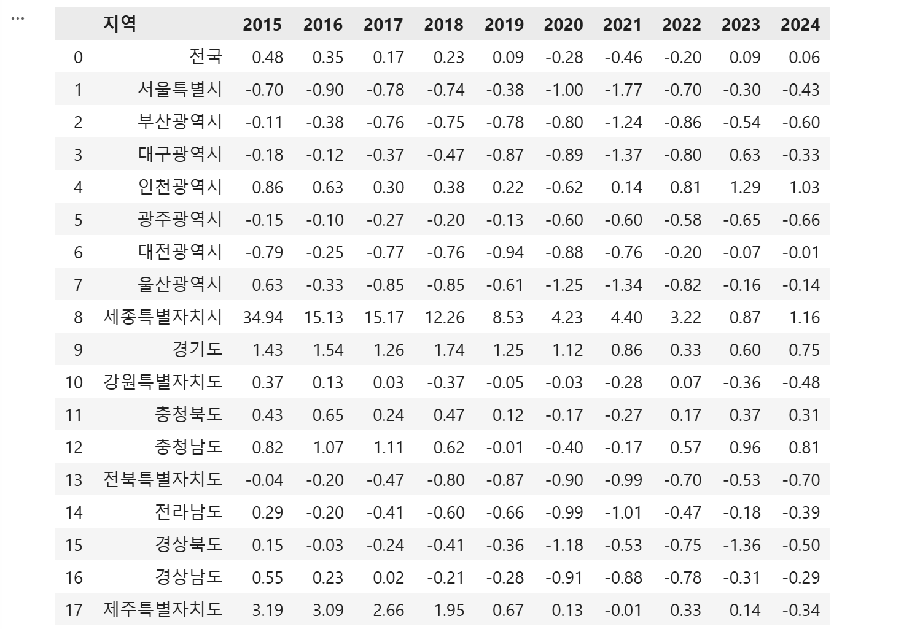
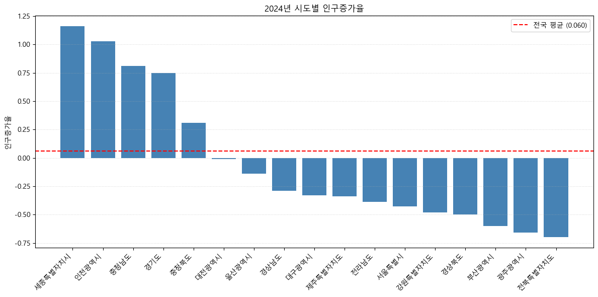
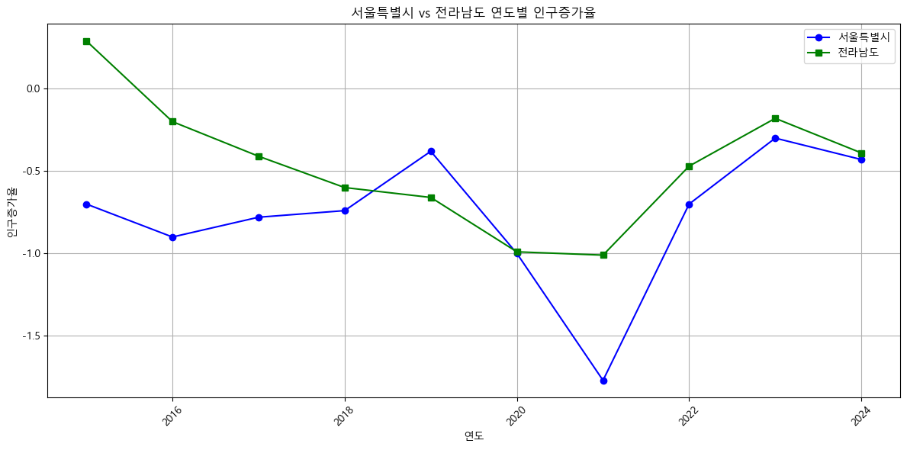
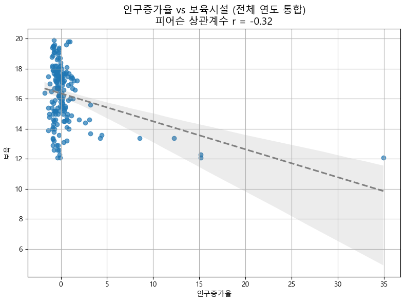
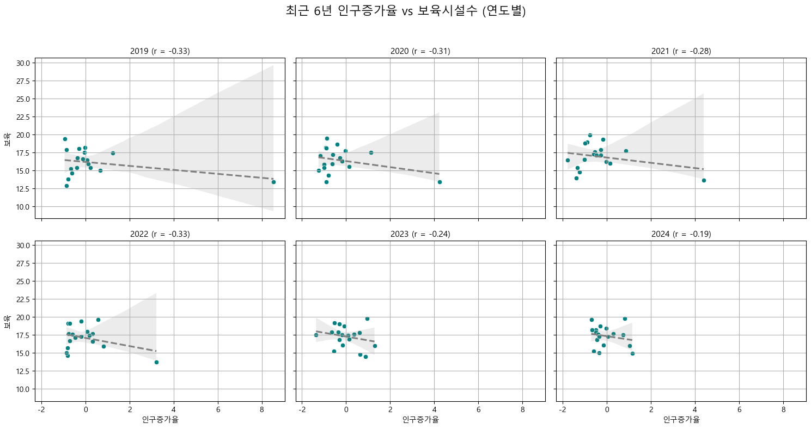
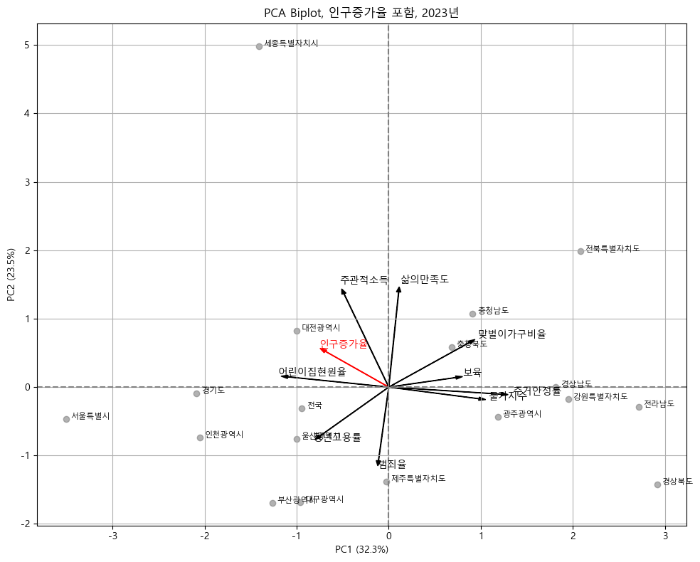
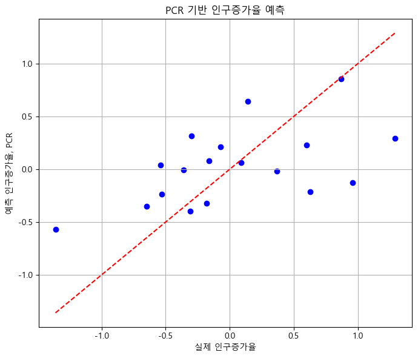

<script setup>
import { ref } from 'vue'

const showImage1 = ref(false)
const showImage2 = ref(false)
const showImage3 = ref(false)
const showImage4 = ref(false)
const showImage5 = ref(false)
const showImage6 = ref(false)
const showImage7 = ref(false)
const showImage8 = ref(false)

const toggleImage = (imageRef) => {
  imageRef.value = !imageRef.value
}
</script>

# 인구증가율 데이터분석

### Pandas와 Matplotlib를 이용한 시도별 인구동향 분석

<div @click="$slidev.nav.next" class="mt-12 py-1" hover:bg="white op-10">
  Press Space for next page <carbon:arrow-right />
</div>

<div class="abs-br m-6 text-xl">
  <button @click="$slidev.nav.openInEditor()" title="Open in Editor" class="slidev-icon-btn">
    <carbon:edit />
  </button>
  <a href="https://github.com/uzaramen108" target="_blank" class="slidev-icon-btn">
    <carbon:logo-github />
  </a>
  양원석 / 박찬서 / 박기성
</div>

---
layout: default
class: px-20 py-10
---

# 📊 분석 개요
<div class="border-b-2 border-blue-500 w-20 mb-12"></div>

<div grid="~ cols-2 gap-12" class="text-left mt-10">

<div class="bg-gray-50/5 p-6 rounded-xl border border-gray-200/60 shadow-sm">

### 🔹 분석 목표
<ul class="list-disc pl-5 space-y-4 text-lg opacity-90 mt-4">
  <li>전국 시도별 인구증가율 추이 분석</li>
  <li>인구증가율과 주요 사회지표의 상관관계 분석</li>
  <li>다변량 분석을 통한 영향요인 파악</li>
</ul>

</div>

<div class="bg-gray-50/5 p-6 rounded-xl border border-gray-200/60 shadow-sm">

### 🔹 분석 범위
<div class="space-y-6 mt-4">
  <div>
    <span class="font-bold text-blue-400">분석 데이터</span>
    <p class="text-sm opacity-80 mt-1 leading-relaxed">인구증가율, 보육시설, 주거안정률, 삶의 만족도, 주관적 소득, 맞벌이 비율, 물가지수, 범죄율, 청년 고용률, 어린이집 현원율</p>
  </div>
  <div>
    <span class="font-bold text-blue-400">시간/공간 범위</span>
    <p class="text-sm opacity-80 mt-1">여러 연도 연계 데이터 / 전국 17개 시도</p>
  </div>
</div>

</div>

</div>

---
layout: default
---

# 1. 데이터 전처리
<div class="text-xl opacity-80 mb-8">라이브러리 세팅 및 데이터 전처리</div>

<div class="grid grid-cols-3 gap-8">

<div class="col-span-2">

<div class="overflow-y-auto max-h-[360px] shadow-lg rounded-md border border-gray-200/20 text-sm">

```python 
# 라이브러리 세팅
import platform 
import matplotlib.pyplot as plt 
import pandas as pd
import numpy as np
import re

# 인구증가율 엑셀 다시 읽기
df = pd.read_excel("인구증가율.xlsx",
    engine="openpyxl", header=[0, 1])

# 결측치 처리
df.replace(['-', '--', '…'], np.nan, inplace=True)

# 연도 이름 정리 함수
def clean_year(x):
    text = str(x)
    match = re.search(r'(19\d{2}|20\d{2})', text)
    if match:
        return match.group(1)
    return text

# 행정구역 컬럼 찾기
region_col = [
    col for col in df.columns
    if ('행정구역' in str(col[0])) or (
    '시도' in str(col[0])) or ('시군구' in str(col[0]))
][0]

# 인구증가율 컬럼 찾기
pop_cols = [
    col for col in df.columns
    if ('인구증가율' in str(col[0])) or (
    '인구증가율' in str(col[1]))
]

# 필요한 열만 추출
df_pop = df[[region_col] + pop_cols].copy()

# 열 이름 단순화
df_pop.columns = ['지역'] + [clean_year(col[0]) for col in pop_cols]

# 숫자형으로 변환
for col in df_pop.columns[1:]:
    df_pop[col] = pd.to_numeric(df_pop[col], errors='coerce')

# 지역명 공백 제거
df_pop['지역'] = df_pop['지역'].astype(str).str.strip()

df_pop.head(len(df_pop))
```

</div>

</div>

<div class="col-span-1">

<div class="text-[13px] space-y-4">

### 🛠️ 전처리 작업 핵심 정리
- **데이터 로딩 및 결측치 처리**: `openpyxl`을 이용해 다중 헤더(Multi-index) 엑셀을 파싱하고, 연산 불가능한 기호(`-`, `--`, `…`)를 `NaN`으로 일괄 치환합니다.
- **컬럼명 정제 및 표준화**: 정규표현식(`re`)을 활용해 복잡한 컬럼명에서 '연도(YYYY)'만 정확히 추출합니다.
- **자료형 변환 및 공백 제거**: 문자열 데이터를 수치형(`pd.to_numeric`)으로 변환하고 양끝의 공백을 제거합니다.

<button @click="isExpanded = true" class="mt-4 px-4 py-2 bg-blue-500 text-white text-sm rounded shadow-md hover:bg-blue-600 transition-all flex items-center gap-2">
  <carbon:zoom-in /> 분석 결과 보기
</button>

<div v-if="isExpanded" class="fixed inset-4 z-50 bg-white shadow-2xl rounded-xl p-8 overflow-y-auto border border-gray-300 flex flex-col">

  <div class="flex justify-between items-center mb-4 border-b pb-4 shrink-0">
    <div class="text-xl font-bold text-gray-800">분석 결과 시각화</div>
    <button @click="isExpanded = false" class="px-4 py-1.5 bg-red-500 text-white rounded hover:bg-red-600 transition-all text-sm flex items-center gap-1">
      <carbon:close /> 닫기
    </button>
  </div>

  

</div>

</div>
</div>

</div>

<script setup>
import { ref } from 'vue'
const isExpanded = ref(false)
</script>

---
layout: default
---

# 2. 인구증가율 시도별 분석
<div class="text-xl opacity-80 mb-8">최신 연도 기준 전국 평균 비교</div>

<div class="grid grid-cols-3 gap-8">

<div class="col-span-2">

<div class="overflow-y-auto max-h-[360px] shadow-lg rounded-md border border-gray-200/20 text-sm">

```python
# 가장 최신 연도 자동 선택
year = df_pop.columns[-1]

# 특정 연도 데이터 정렬, 전국 제외
df_year = df_pop[df_pop['지역'] != '전국'][['지역', year]].copy()
df_year = df_year.sort_values(year, ascending=False)

# 전국 평균값 따로 추출
national_avg = df_pop[df_pop['지역'] == '전국'][year].values[0]

# 시각화
plt.figure(figsize=(12, 6))
plt.bar(df_year['지역'], df_year[year], color='steelblue')

# 전국 평균선 추가
plt.axhline(
    y=national_avg,
    color='red',
    linestyle='--',
    label=f'전국 평균 ({national_avg:.3f})'
)

plt.title(f'{year}년 시도별 인구증가율')
plt.ylabel('인구증가율')
plt.xticks(rotation=45, ha='right')
plt.legend()
plt.grid(True, axis='y', linestyle=':', alpha=0.5)
plt.tight_layout()
plt.show()
```

</div>

</div>

<div class="col-span-1">

<div class="text-[13px] space-y-4">

### 시각화 및 분석 결과
- **시도별 순위화 (막대 그래프)**: 최신 연도 데이터만 추출한 뒤 `sort_values()`를 통해 내림차순으로 정렬했습니다. 이를 통해 17개 시도의 인구증가율 순위와 지역 간의 편차(격차)를 직관적으로 파악할 수 있도록 묘사했습니다.
- **전국 평균 기준선 (빨간 점선)**: `plt.axhline`을 활용해 전국 평균값을 화면을 가로지르는 빨간 점선으로 배치했습니다. 이 선은 평균을 상회하는 '인구 유입/성장 지역'과 하회하는 '인구 유출/감소 지역'을 시각적으로 명확히 양분합니다.

<button @click="isExpanded = true" class="mt-4 px-4 py-2 bg-blue-500 text-white text-sm rounded shadow-md hover:bg-blue-600 transition-all flex items-center gap-2">
  <carbon:zoom-in /> 분석 결과 크게 보기
</button>

<div v-if="isExpanded" class="fixed inset-4 z-50 bg-white shadow-2xl rounded-xl p-8 overflow-y-auto border border-gray-300 flex flex-col">

  <div class="flex justify-between items-center mb-4 border-b pb-4 shrink-0">
    <div class="text-xl font-bold text-gray-800">분석 결과 시각화</div>
    <button @click="isExpanded = false" class="px-4 py-1.5 bg-red-500 text-white rounded hover:bg-red-600 transition-all text-sm flex items-center gap-1">
      <carbon:close /> 닫기
    </button>
  </div>

  

</div>

</div>
</div>

</div>

<script setup>
import { ref } from 'vue'
const isExpanded = ref(false)
</script>

---
layout: default
---

# 3. 서울vs전라남도 연도별 비교
<div class="text-xl opacity-80 mb-8">주요 거점 간 시계열 변동 추이 비교</div>

<div class="grid grid-cols-3 gap-8">

<div class="col-span-2">

<div class="overflow-y-auto max-h-[360px] shadow-lg rounded-md border border-gray-200/20 text-sm">

```python
seoul = df_pop[df_pop['지역'] == '서울특별시'].iloc[0, 1:]
jeonnam = df_pop[df_pop['지역'] == '전라남도'].iloc[0, 1:]

# 열 이름을 정수형으로 변환
seoul.index = seoul.index.astype(int)
jeonnam.index = jeonnam.index.astype(int)

# 값도 수치형으로 변환
seoul = seoul.astype(float)
jeonnam = jeonnam.astype(float)

# x축 연도
years = seoul.index

# 시각화
plt.figure(figsize=(12, 6))
plt.plot(years, seoul, label='서울특별시', color='blue', marker='o')
plt.plot(years, jeonnam, label='전라남도', color='green', marker='s')

plt.title('서울특별시 vs 전라남도 연도별 인구증가율')
plt.xlabel('연도')
plt.ylabel('인구증가율')
plt.xticks(rotation=45)
plt.grid(True)
plt.legend()
plt.tight_layout()
plt.show()
```

</div>

</div>

<div class="col-span-1">

<div class="text-[13px] space-y-4">

##### 인구증가율 추이 분석 및 특이점
- **코드 포인트**: `.iloc[0, 1:]`로 연도별 값 추출 후, `astype(int)`로 x축 연도 라벨을 자동 정렬하여 두 지역의 시계열을 단일 차트에 투영.
- **서울 인구증가율 주요 변동 원인**:
  - <span class="text-blue-500 font-bold">2019년 (상승)</span>: 일자리와 교육 인프라를 찾아 2030 청년층이 서울로 대거 유입되는 **'블랙홀 현상'** 극대화. 인구 감소세 일시 둔화.
  - <span class="text-red-500 font-bold">2021년 (급감)</span>: 아파트 평균 매매가 10억 돌파 등 역대급 집값 폭등 및 주거비 부담 가중으로 인한 심각한 **'탈서울 현상'** 발생.

<button @click="isExpanded = true" class="mt-4 px-4 py-2 bg-blue-500 text-white text-sm rounded shadow-md hover:bg-blue-600 transition-all flex items-center gap-2">
  <carbon:zoom-in /> 분석 결과 크게 보기
</button>

<div v-if="isExpanded" class="fixed inset-4 z-50 bg-white shadow-2xl rounded-xl p-8 overflow-y-auto border border-gray-300 flex flex-col">

  <div class="flex justify-between items-center mb-4 border-b pb-4 shrink-0">
    <div class="text-xl font-bold text-gray-800">분석 결과 시각화</div>
    <button @click="isExpanded = false" class="px-4 py-1.5 bg-red-500 text-white rounded hover:bg-red-600 transition-all text-sm flex items-center gap-1">
      <carbon:close /> 닫기
    </button>
  </div>

  

</div>

</div>
</div>

</div>

<script setup>
import { ref } from 'vue'
const isExpanded = ref(false)
</script>

---
layout: default
---

# 4. 상관관계 분석 (전체 연도 통합)
<div class="text-xl opacity-80 mb-8">롱포맷 데이터 병합 및 선형 회귀 분석</div>

<div class="grid grid-cols-3 gap-8">

<div class="col-span-2">

<div class="overflow-y-auto max-h-[360px] shadow-lg rounded-md border border-gray-200/20 text-sm">

```python
import seaborn as sns

# 1. 전체 연도에 대해 인구증가율 vs 보육 데이터 수집
data = []

for year in df_pivoted.columns.levels[0]:
    if (year, '인구증가율') in df_pivoted.columns and (year, '보육') in df_pivoted.columns:
        pop = df_pivoted[(year, '인구증가율')]
        facility = df_pivoted[(year, '보육')]

        for region, p, f in zip(df_pivoted.index, pop, facility):
            if pd.notna(p) and pd.notna(f):
                data.append({
                    '지역': region,
                    '연도': int(year),
                    '인구증가율': p,
                    '보육': f
                })

# 2. DataFrame 생성
df_all = pd.DataFrame(data)

# 3. 전체 상관계수 계산
r = df_all['인구증가율'].corr(df_all['보육'])

# 4. 시각화
plt.figure(figsize=(8, 6))
sns.regplot(
    data=df_all,
    x='인구증가율',
    y='보육',
    scatter_kws={'alpha': 0.7},
    line_kws={'color': 'gray', 'linestyle': 'dashed'}
)

plt.title(f"인구증가율 vs 보육시설 (전체 연도 통합)\n피어슨 상관계수 r = {r:.2f}", fontsize=14)
plt.grid(True)
plt.tight_layout()
plt.show()
```

</div>

</div>

<div class="col-span-1">

<div class="text-[13px] space-y-4">

### 다변량 병합 분석
- **코드 포인트**: `sns.regplot()`을 활용하여 산점도 위에 선형 회귀(Linear Regression) 선과 95% 신뢰구간을 자동으로 계산 및 시각화. `df_pivoted` 구조에서 연도별 '인구증가율'과 '보육' 데이터를 매칭한 뒤, 결측치(`pd.notna`)를 필터링하여 통합 롱포맷(Long-form) 데이터프레임으로 재구축.
- **분석 결과**: `r = -0.32`로 인구증가율과 보육시설 수는 뚜렷한 선형관계가 없음을 보임.

<button @click="isExpanded = true" class="mt-4 px-4 py-2 bg-blue-500 text-white text-sm rounded shadow-md hover:bg-blue-600 transition-all flex items-center gap-2">
  <carbon:zoom-in /> 분석 결과 크게 보기
</button>

<div v-if="isExpanded" class="fixed inset-4 z-50 bg-white shadow-2xl rounded-xl p-8 overflow-y-auto border border-gray-300 flex flex-col">

  <div class="flex justify-between items-center mb-4 border-b pb-4 shrink-0">
    <div class="text-xl font-bold text-gray-800">분석 결과 시각화</div>
    <button @click="isExpanded = false" class="px-4 py-1.5 bg-red-500 text-white rounded hover:bg-red-600 transition-all text-sm flex items-center gap-1">
      <carbon:close /> 닫기
    </button>
  </div>

  

</div>

</div>
</div>

</div>

<script setup>
import { ref } from 'vue'
const isExpanded = ref(false)
</script>

---
layout: default
---

# 5. 연도별 상관계수 변화
<div class="text-xl opacity-80 mb-8">서브플롯 기반 시변성 상관관계 추적</div>

<div class="grid grid-cols-3 gap-8">

<div class="col-span-2">

<div class="overflow-y-auto max-h-[360px] shadow-lg rounded-md border border-gray-200/20 text-sm">

```python
# 1. 최근 6년 추출
recent_years = sorted(df_all['연도'].unique())[-6:]
n_rows, n_cols = 2, 3

# 2. 플롯 준비
fig, axes = plt.subplots(n_rows, n_cols, figsize=(15, 8), sharex=True, sharey=True)
axes = axes.flatten()

# 3. 각 연도별 플롯
for i, year in enumerate(recent_years):
    ax = axes[i]
    subset = df_all[df_all['연도'] == year]

    # 산점도
    sns.scatterplot(data=subset, x='인구증가율', y='보육', ax=ax, color='teal')

    # 회귀선
    sns.regplot(
        data=subset,
        x='인구증가율',
        y='보육',
        ax=ax,
        scatter=False,
        color='gray',
        line_kws={'linestyle': 'dashed'}
    )

    # 상관계수 계산
    corr = subset[['인구증가율', '보육']].corr(method='pearson').iloc[0, 1]

    # 타이틀
    ax.set_title(f"{year} (r = {corr:.2f})", fontsize=11)
    ax.grid(True)

# 4. 공통 제목
fig.suptitle("최근 6년 인구증가율 vs 보육시설수 (연도별)", fontsize=16)
plt.tight_layout(rect=[0, 0, 1, 0.95])
plt.show()
```

</div>

</div>

<div class="col-span-1">

<div class="text-[13px] space-y-4">

### 시간적 변화 분석
- **코드 포인트**: 최근 6개년 데이터를 $2 \times 3$ 서브플롯 그리드로 동시 분할 구현, `sharex`/`sharey` 축 공유 설정을 통해 일관된 스케일 비교, 매 스텝 상관계수를 타이틀에 맵핑
- **분석 결과**: 변수 간 관계 지표가 고정되지 않고 시간에 따라 변동하는 추세 모니터링. 미미하지만 시간이 지날수록 r이 증가.

<button @click="isExpanded = true" class="mt-4 px-4 py-2 bg-blue-500 text-white text-sm rounded shadow-md hover:bg-blue-600 transition-all flex items-center gap-2">
  <carbon:zoom-in /> 분석 결과 크게 보기
</button>

<div v-if="isExpanded" class="fixed inset-4 z-50 bg-white shadow-2xl rounded-xl p-8 overflow-y-auto border border-gray-300 flex flex-col">

  <div class="flex justify-between items-center mb-4 border-b pb-4 shrink-0">
    <div class="text-xl font-bold text-gray-800">분석 결과 시각화</div>
    <button @click="isExpanded = false" class="px-4 py-1.5 bg-red-500 text-white rounded hover:bg-red-600 transition-all text-sm flex items-center gap-1">
      <carbon:close /> 닫기
    </button>
  </div>

  

</div>

</div>
</div>

</div>

<script setup>
import { ref } from 'vue'
const isExpanded = ref(false)
</script>

---
layout: default
---

# 6. 다변량 분석 (PCA Biplot)
<div class="text-xl opacity-80 mb-8">차원 축소 및 고차원 로딩 벡터 시각화</div>

<div class="grid grid-cols-3 gap-8">

<div class="col-span-2">

<div class="overflow-y-auto max-h-[360px] shadow-lg rounded-md border border-gray-200/20 text-sm">

```python
from sklearn.decomposition import PCA
from sklearn.preprocessing import StandardScaler
from sklearn.metrics.pairwise import cosine_similarity
from sklearn.linear_model import LinearRegression

# 1. 변수 선택
variables = [
    '인구증가율',
    '보육',
    '주거안정률',
    '삶의만족도',
    '주관적소득',
    '맞벌이가구비율',
    '물가지수',
    '범죄율',
    '청년고용률',
    '어린이집현원율'
]

# 2. 분석 연도 선택, 공통 연도 중 가장 최신 연도
year = max(years)

print("PCA 분석 연도:", year)

# 3. 해당 연도 데이터 준비
df_year = df_pivoted[year].dropna()

X = df_year[variables]

# 4. 표준화
scaler = StandardScaler()
X_scaled = scaler.fit_transform(X)

# 5. PCA
pca = PCA(n_components=2)
X_pca = pca.fit_transform(X_scaled)

# 6. 변수 방향 벡터
vectors = pca.components_.T

# 7. Biplot 시각화
plt.figure(figsize=(10, 8))

# 지역 점 표시
for i, name in enumerate(X.index):
    plt.scatter(X_pca[i, 0], X_pca[i, 1], color='gray', alpha=0.6)
    plt.text(X_pca[i, 0] + 0.05, X_pca[i, 1], name, fontsize=8)

# 변수 벡터 표시
scaled_factor = 2.5

for i, var in enumerate(variables):
    color = 'red' if var == '인구증가율' else 'black'
    
    plt.arrow(
        0, 0,
        vectors[i, 0] * scaled_factor,
        vectors[i, 1] * scaled_factor,
        color=color,
        width=0.005,
        head_width=0.05
    )
    
    plt.text(
        vectors[i, 0] * scaled_factor * 1.1,
        vectors[i, 1] * scaled_factor * 1.1,
        var,
        color=color,
        fontsize=10
    )

# 꾸미기
plt.axhline(0, color='gray', linestyle='--')
plt.axvline(0, color='gray', linestyle='--')
plt.xlabel(f"PC1 ({pca.explained_variance_ratio_[0] * 100:.1f}%)")
plt.ylabel(f"PC2 ({pca.explained_variance_ratio_[1] * 100:.1f}%)")
plt.title(f"PCA Biplot, 인구증가율 포함, {year}년")
plt.grid(True)
plt.tight_layout()
plt.show()
```

</div>

</div>

<div class="col-span-1">

<div class="text-[13px] space-y-4">

### PCA Biplot 해석
- **코드 포인트**: 변수 스케일 왜곡 방지를 위한 `StandardScaler` 적용, `PCA(n_components=2)`를 통한 2차원 평면 차원 감소, 샘플 좌표와 로딩 방향 벡터를 동시 표현하는 Biplot 구현
- **분석 결과**: 인구 증가율 벡터와 가까운 방향을 가지는 벡터(어린이집현원율, 주관적 소득)는 양의 상관관계를, 반대에 가까운 벡터(물가지수)는 음의 상관관계를 나타냄.

<button @click="isExpanded = true" class="mt-4 px-4 py-2 bg-blue-500 text-white text-sm rounded shadow-md hover:bg-blue-600 transition-all flex items-center gap-2">
  <carbon:zoom-in /> 분석 결과 크게 보기
</button>

<div v-if="isExpanded" class="fixed inset-4 z-50 bg-white shadow-2xl rounded-xl p-8 overflow-y-auto border border-gray-300 flex flex-col">

  <div class="flex justify-between items-center mb-4 border-b pb-4 shrink-0">
    <div class="text-xl font-bold text-gray-800">분석 결과 시각화</div>
    <button @click="isExpanded = false" class="px-4 py-1.5 bg-red-500 text-white rounded hover:bg-red-600 transition-all text-sm flex items-center gap-1">
      <carbon:close /> 닫기
    </button>
  </div>

  

</div>

</div>
</div>

</div>

<script setup>
import { ref } from 'vue'
const isExpanded = ref(false)
</script>

---
layout: default
---

# 7. 회귀분석 (PCR)
<div class="text-xl opacity-80 mb-8">주성분 회귀 기반 다중공선성 제어 및 추정</div>

<div class="grid grid-cols-3 gap-8">

<div class="col-span-2">

<div class="overflow-y-auto max-h-[360px] shadow-lg rounded-md border border-gray-200/20 text-[12px] leading-tight">

```python
# 1. 독립변수와 종속변수 설정
x_variables = [
    '보육',
    '주거안정률',
    '삶의만족도',
    '주관적소득',
    '맞벌이가구비율',
    '물가지수',
    '범죄율',
    '청년고용률',
    '어린이집현원율'
]

year = max(years)
print("PCR 분석 연도:", year)

df_year = df_pivoted[year].dropna()

X = df_year[x_variables]
y = df_year['인구증가율']

# 2. X 표준화
scaler = StandardScaler()
X_scaled = scaler.fit_transform(X)

# 3. PCA 적용
pca = PCA()
X_pca = pca.fit_transform(X_scaled)

# 4. 누적 분산으로 주성분 수 결정, 80% 이상
explained_ratio = np.cumsum(pca.explained_variance_ratio_)
n_components = np.argmax(explained_ratio >= 0.8) + 1

print(f"선택된 주성분 개수: {n_components}")
print("누적 설명분산:", explained_ratio)

# 5. 회귀분석
X_pca_reduced = X_pca[:, :n_components]

model = LinearRegression()
model.fit(X_pca_reduced, y)

# 6. 예측값과 설명력
y_pred = model.predict(X_pca_reduced)
r_squared = model.score(X_pca_reduced, y)

print(f"R² 설명력: {r_squared:.3f}")

plt.figure(figsize=(7, 6))

plt.scatter(y, y_pred, color='blue')
plt.plot([y.min(), y.max()], [y.min(), y.max()], 'r--')

plt.xlabel('실제 인구증가율')
plt.ylabel('예측 인구증가율, PCR')
plt.title('PCR 기반 인구증가율 예측')
plt.grid(True)
plt.tight_layout()
plt.show()
```

</div>

</div>

<div class="col-span-1">

<div class="text-[13px] space-y-4">

### 주성분 회귀 모델링 (PCR)
- **차원 축소 및 최적화**: 2023년 데이터를 기준으로, 원본 분산의 80% 이상을 보존하는 주성분($k=4$)을 자동 추출하여 모델에 적용.
- **설명력 평가 ($R^2 = 0.302$)**: 4개의 주성분이 인구증가율 분산의 약 30.2%를 설명.
- **결과 해석**: 그래프의 파란 점들이 기준선(완벽한 예측을 의미하는 빨간 점선, $y=x$) 주변으로 다소 흩어져 분포합니다. 이는 모델이 전체적인 우상향 경향성은 어느 정도 파악하나, 해당 지표들 외에도 복합적인 요인이 얽혀 있음을 시각적으로 보여줍니다.

<button @click="isExpanded = true" class="mt-4 px-4 py-2 bg-blue-500 text-white text-sm rounded shadow-md hover:bg-blue-600 transition-all flex items-center gap-2">
  <carbon:zoom-in /> 분석 결과 크게 보기
</button>

<div v-if="isExpanded" class="fixed inset-4 z-50 bg-white shadow-2xl rounded-xl p-8 overflow-y-auto border border-gray-300 flex flex-col">

  <div class="flex justify-between items-center mb-4 border-b pb-4 shrink-0">
    <div class="text-xl font-bold text-gray-800">분석 결과 시각화</div>
    <button @click="isExpanded = false" class="px-4 py-1.5 bg-red-500 text-white rounded hover:bg-red-600 transition-all text-sm flex items-center gap-1">
      <carbon:close /> 닫기
    </button>
  </div>

  

</div>

</div>
</div>

</div>

<script setup>
import { ref } from 'vue'
const isExpanded = ref(false)
</script>

---
layout: default
class: px-20 py-10
---

# 분석 결론
<div class="border-b-2 border-blue-500 w-20 mb-8"></div>

<div class="grid grid-cols-2 gap-10 mt-6">

  <div class="bg-gray-50/5 p-8 rounded-xl border border-gray-200/60 shadow-sm flex flex-col">
    <h3 class="text-xl font-bold text-blue-500 mb-6">분석 후 느낀점</h3>
    <ul class="list-none space-y-5 text-[11.5px] leading-relaxed opacity-90 m-0 p-0">
      <li class="flex gap-3">
        <span class="text-blue-400">🔹</span>
        <div><strong class="text-gray-800 dark:text-gray-200 text-[14.5px]">데이터분석 라이브러리</strong><br>Pandas와 Matplotlib을 통해 원하는 지역별 인구증가율 분석 등 사용자의 의도대로 커스텀하여 세밀한 분석이 가능했음.</div>
      </li>
      <li class="flex gap-3">
        <span class="text-blue-400">🔹</span>
        <div><strong class="text-gray-800 dark:text-gray-200 text-[14.5px]">핵심 영향 요인 검증</strong><br>어떤 요인이 인구증가율과 밀접한 관계를 지니는지에 대해 객관적인 지표로 분석이 가능했음.</div>
      </li>
      <li class="flex gap-3">
        <span class="text-blue-400">🔹</span>
        <div><strong class="text-gray-800 dark:text-gray-200 text-[14.5px]">시간적 가변성 추적</strong><br>데이터 분석을 통해 시간에 따른 해당 지표의 상승 및 하락의 이유를 사회적 요인과 연관지을 수 있음.</div>
      </li>
    </ul>
  </div>

  <div class="bg-gray-50/5 p-8 rounded-xl border border-gray-200/60 shadow-sm flex flex-col">
    <h3 class="text-xl font-bold text-teal-500 mb-6">분석 기법 및 환경</h3>
    <ul class="list-none space-y-5 text-[11.5px] leading-relaxed opacity-90 m-0 p-0">
      <li class="flex gap-3">
        <span class="text-teal-400">🔹</span>
        <div><strong class="text-gray-800 dark:text-gray-200 text-[14.5px]">다변량 회귀 (PCR) 모델링</strong><br>다중공선성을 배제한 주성분 회귀 모델을 구축하여, 각 독립변수의 왜곡 없는 기여도 산출 및 유의미한 설명력 확보.</div>
      </li>
      <li class="flex gap-3">
        <span class="text-teal-400">🔹</span>
        <div><strong class="text-gray-800 dark:text-gray-200 text-[14.5px]">주성분 분석 (PCA) 차원 축소</strong><br>고차원 데이터를 2차원 Biplot으로 투영하여 변수 간 상호의존성과 군집성을 직관적으로 시각화.</div>
      </li>
      <li class="flex gap-3">
        <span class="text-teal-400">🔹</span>
        <div><strong class="text-gray-800 dark:text-gray-200 text-[14.5px]">시계열 및 상관 분석</strong><br>단변량 선형 관계선 시각화 및 피어슨 상관계수를 통한 추이 분석.</div>
      </li>
    </ul>
  </div>

</div>

---
layout: center
class: text-center
---

# 🙏 감사합니다!

<div class="mt-8 text-xl text-gray-600 dark:text-gray-300">
  지금까지 <strong class="text-blue-500">인구증가율 데이터 분석</strong> 발표였습니다.
</div>

<div class="mt-12 text-sm text-gray-400">
  Q&A / 자유롭게 질문해 주세요.
</div>
